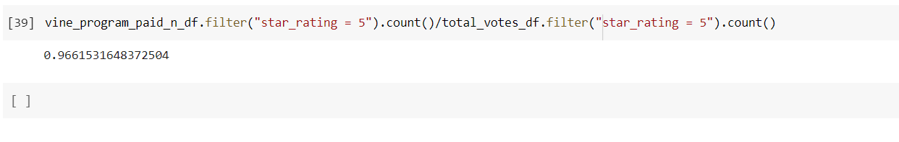

# Amazon_reviews_ETL

1. Overview of the analysis: Explain the purpose of this analysis.

Analyzing Amazon reviews written by members of the paid Amazon Vine program. Gogole Colab was used to run codes, sql was used to connect to the data using Amamzon RDS.

2. Results: Using bulleted lists and images of DataFrames as support, address the following questions:

A. How many Vine reviews and non-Vine reviews were there?

There are 613 paid vine review and 64968 unpaid vine reviews. 

B. How many Vine reviews were 5 stars? How many non-Vine reviews were 5 stars?

The total 5 start ratings of reviews are in total 31613. the vine reviews that were 5 starts are equal to 221 while non-vine reviews are equal to 31,392.

C. What percentage of Vine reviews were 5 stars? What percentage of non-Vine reviews were 5 stars?

The percentage of vine reviews are 7% while non-vine reviews are 97%.

**Summary:** In your summary, state if there is any positivity bias for reviews in the Vine program. Use the results of your analysis to support your statement. Then, provide one additional analysis that you could do with the dataset to support your statement.

Overall I believe there is a bias as the image below shows that that there is some data missing after taking into account total reviews of by e 72587 - 64968 - 613 = 7,006. Also their 97% of non-vine reviews.

